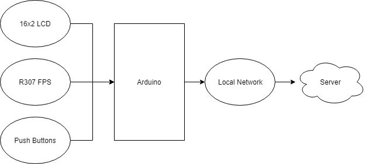
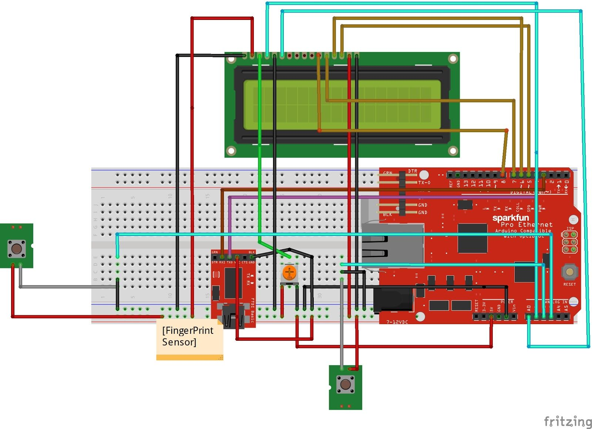
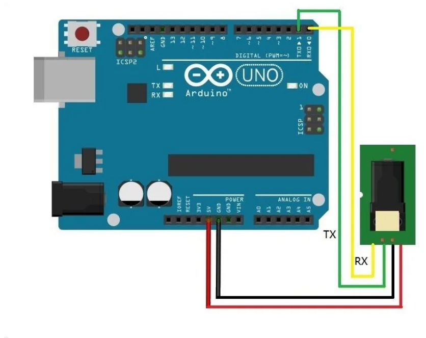
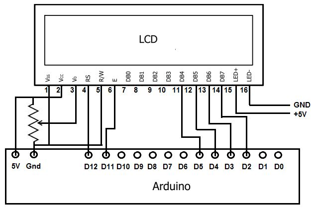
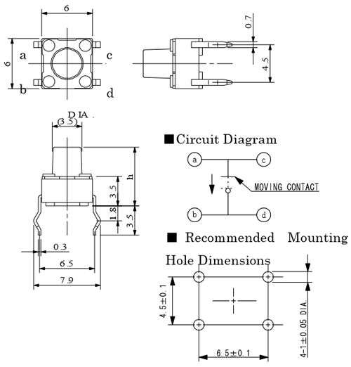
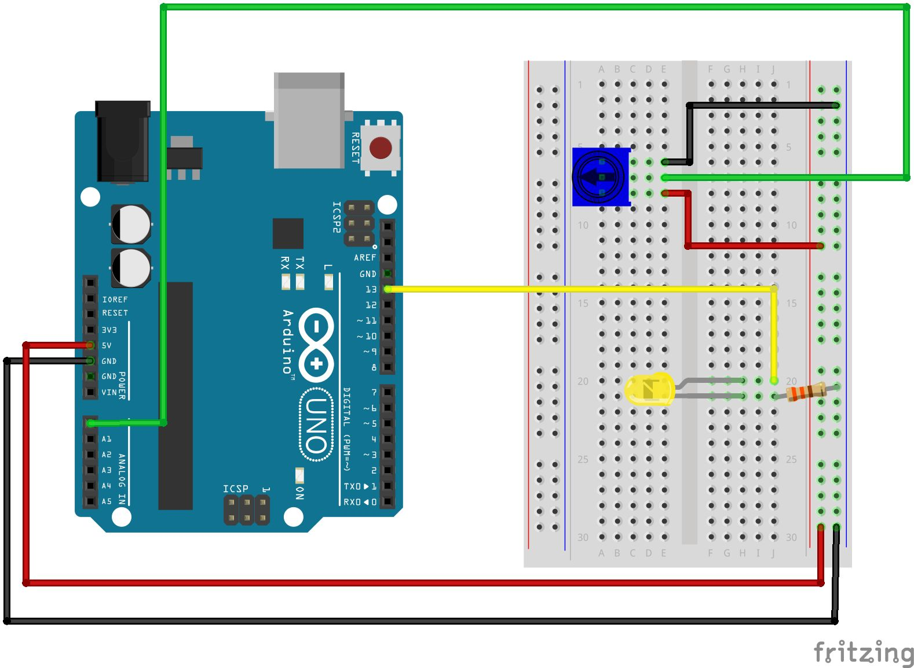
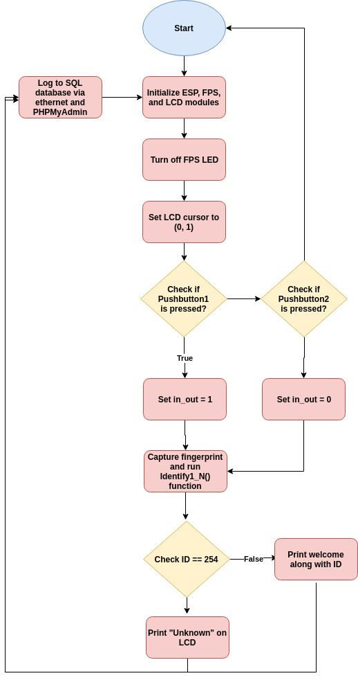

# Biometric-Attendance-System

* ## Motivation
 Few years back if you were to tell someone that the Geyser and bedroom lights in your home are connected to the internet, they would be baffled and might even criticize it as over-engineered products. But today with the advent of IoT, Smart cities etc the idea no longer sounds strange, we have devices around us that have become smarter by being able to communicate with the internet.

 Attendance plays a major role in educational institutions. The most common means of taking attendance in the classroom is by calling out the roll numbers of students or asking the students to manually sign the attendance sheet, which is passed around during the lecture. The process of manually taking and maintaining the attendance records becomes highly cumbersome Biometric systems have reached a sufficiently advanced stage wherein they can now be deployed in systems without hampering portability. With the recent development of various cloud based computing and storage systems, data can be securely stored and retrieved whenever required. Primarily, fingerprints and iris images are considered to be the most reliable for use in biometric systems.

* ## Description And Final Outcome
 In this project our aim is to leverage this IoT into the boring attendance system to make it smart and more effective. Most conventional attendance systems available today store the information over a micro SD card and have to be connected to software via a computer to access the information. Here, we will build a biometric attendance system using Arduino that scans for finger print and on successful identification of the person it will log the information to a cloud platform like ThingsBoard by using the ESP8266 Wi-Fi module. This information can then be displayed in the dashboard of ThingsBoard making it available for the required authorities to view and analysis information over the internet without having any direct physical access to the hardware. However the conventional Attendance system without involving IoT can also be built by following the link and Fingerprint sensor can be further used for many other biometric applications like Voting Machine, Security system etc.

* ## Block Diagram

* ## Circuit Diagram

* ## Components Needed
  * Arduino UNO
  * 16x2 LCD Display
  * Ethernet Shield
  * R307 Fingerprint sensor (FPS)
  * Jumper wires
  * Push Buttons
  * Potentiometer
  * Resistors

* ## Operating Principle of Components
     * **R307 Fingerprint Sensor Module**:-
   The features of this sensor include the following.
          * It includes image collection as well as chip algorithm.
          * The fingerprint reader can perform lesser growth and can be fixed into a range of end products.
          * Power use is low, excellent performance, small in size, and less cost.
          * Optical technology which is used is professional, and exact module developed techniques.
          * The capabilities of image processing are good, and can effectively capture pictures up to 500 dpi resolution.    
  **Working Principle:**
    The working principle of the fingerprint sensor mainly depends on the processing. The fingerprint processing mainly includes two elements namely enrollment and matching. In fingerprint enrolling, every user requires to place the finger twice. So that the system will check the finger images to process as well as to generate a pattern of the finger and it will be stored. When matching, a user places the finger using an optical sensor then the system will produce a pattern of the finger & compares it with the finger library templates. For 1:1 fingerprint matching, the system will evaluate the exits finger with a precise pattern which is selected within the module. Similarly, for 1: N matching, the scanning system will look for the complete finger records for the finger matching. In both situations, the scanning system will go back to the corresponding result, success otherwise crash.
    
   
   *Fingerprint Sensor Interfacing using Arduino*
        
     * **16x2 LCD Display:**
  Character lcd's come in many sizes 8x1, 8x2, 10x2, 16x1, 16x2, 16x4, 20x2, 20x4, 24x2, 30x2, 32x2, 40x2 etc . Many multinational companies like Philips, Hitachi, Panasonic make their own custom type of character lcd's to be used in their products. All character lcd's performs the same functions(display characters numbers special characters, ascii characters etc).Their programming is also the same and they all have the same 14 pins (0-13) or 16 pins (0 to 15).
  *In an m x n lcd. M denotes number of coulombs and n represents number of rows. Like if the lcd is denoted by 16x2 it means it has 16 coulombs and 2 rows. On a character lcd a character is generated in a matrix of 5x8 or 5x7. Where 5 represents number of coulombs and 7/8 represent number of rows. Maximum size of the matrix is 5x8. You can not display character greater than 5x8 dimension matrix. Normally we display a character in 5x7 matrix and left the 8th row for the cursor. If we use the 8th row of the matrix for the character display, then their will be no room for cursor. The picture below shows the 5x8 dot matrix pixels arrangement.*

   
   *LCD Interfacing using Arduino*
 
     * **Push Button:**
     A Push Button is a type of switch works on a simple mechanism called “Push-to-make”. Initially, it remains in off state or normally open state but when it is pressed, it allows the current to pass through it or we can say it makes the circuit when pressed. Normally their body is made up of plastic or metal in some types.
  
  
  
  The working concept of Push Button is given above, till the button pressed it conducts current through it or make the circuit. As the button released it break the circuit again.

     * **Potentiometer**
     A potentiometer is an instrument for measuring voltage by comparison of an unknown voltage with a known reference voltage. If a sensitive indicating instrument is used, very little current is drawn from the source of the unknown voltage. Since the reference voltage can be produced from an accurately calibrated voltage divider, a potentiometer can provide high precision in measurement. The method was described by Johann Christian Poggendorff around 1841 and became a standard laboratory measuring technique.
  **Working Principle:**
  The principle of a potentiometer is that the potential dropped across a segment of a wire of uniform cross-section carrying a constant current is directly proportional to its length. The potentiometer is a simple device used to measure the electrical potentials(or compare the e.m.f of a cell). One form of potentiometer is a uniform high-resistance wire attached to an insulating support, marked with a linear measuring scale. In use, an adjustable regulated voltage source E, of greater magnitude than the potential to be measured, is connected across the wire so as to pass a steady current through it. 
  Between the end of the wire and any point along it will be a potential proportional to the length of wire to that point. By comparing the potential at points along the wire with an unknown potential, the magnitude of the unknown potential can be determined. The instrument used for comparison must be sensitive, but need not be particularly well-calibrated or accurate so long as its deflection from zero position can be easily detected.
    
  

* ## Ethernet Shield
The W5100 is a versatile single-chip network interface chip with a 10/100Mbs Ethernet controller integrated internally. It is mainly used in a high integrated, high stable, high performance and low cost embedded system. The W5100 enables you to connect to the Internet without operation system. It is also compatible with IEEE802.3 10BASE-T and 802.3u 100BASE-TX. W5100 integrates a market-proven full-hardware TCP/IP protocol stack inside, Ethernet media access control (MAC) layer and physical layer (PHY). The hardware TCP/IP protocol stack supports the following protocols: TCP, UDP, IPV4, ICMP, ARP, IGMP and PPoE, which have been tested by the market for years in many fields. In addition, W5100 also integrates 16KB memory for data transmission. For W5100, you don't need to consider the control of the Ethernet; what you need to do is socket programming. The W5100 has three interfaces: direct parallel bus, indirect parallel bus and SPI bus. It is easy to connect it with an MCU, just like accessing an external memory. Here we use the Ethernet library to apply W5100 more easily and conveniently.

* ## Explanation
There are two push buttons one for check-in and other for check out. On pressing check in button and putting finger on sensor, fingerprint of person is detected and verified. Time corresponding to check in will be inserted in database. At the time of check-out person is identified by his fingerprint and corresponding time will be inserted in database.

* ## Flowchart

